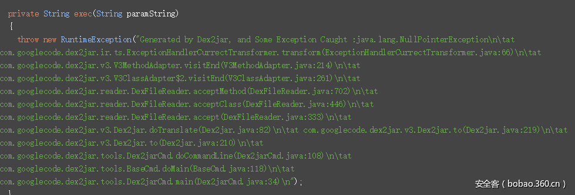

# 花指令

* `加花` = `花指令`
  * 名称：
    * `花指令`
      * 又称：
        * `垃圾指令`
          * `指令`其实就是`字节`
            * =`Junk Bytes`=`JunkBytes`
        * `垃圾代码`=`Junk Code`=`JunkCode`
    * 把`花指令`加到代码中的动作：`加花`
  * 起源：`花指令`这个词来源于汇编语言
  * 含义：在真实代码中插入一些（`垃圾`的、`无用`的）`代码`/`指令`/`字节`，但又不会改变程序的原始逻辑，确保原有程序的正确执行
  * 目的：反汇编工具在反汇编时会出错，导致反汇编工具失效，提高破解难度
    * 隐藏掉不想被逆向工程的代码块(或其它功能)的一种方法，使得程序无法很容易地反编译，即使被反编译后，也难以理解程序内容， 达到混淆视听的效果，增加破解和逆向的难度
  * 主要思想
    * 当花指令跟正常指令的开始几个字节被反汇编工具识别成一条指令的时候，才可以使得反汇编工具报错
    * 插入的花指令都是一些随机的但是不完整的指令
  * 特点
    * 花指令必须要满足两个条件
      * 在程序运行时，花指令是位于一个永远也不会被执行的路径中
      * 这些花指令也是合法指令的一部分，只不过它们是不完整指令而已
  * 实现思路
    * 在每个要保护的代码块之前插入无条件分支语句和花指令
      * 
  * 实际案例
    * Dalvik Bytecode Obfuscation on Android中，插入fill-array-data-payload花指令，导致反编译工具失效
      * 
  * 现存服务提供商
    * 举例
      * 网易易盾的：安卓dex加花保护
  * 相关背景
    * 反汇编工具常用算法
      * 线性扫描算法
        * 逻辑：依次按顺序逐个地将每一条指令反汇编成汇编指令
        * 结果：容易把花指令错误识别，导致反汇编出错
        * 举例
          * 指令
            * 
          * 反汇编后出错
            * 
      * 递归扫描算法
        * 逻辑：按顺序逐个反汇编指令
          * 如果某个地方出现了分支，就会把这个分支地址记录下来，然后对这些反汇编过程中碰到的分支进行反汇编
        * 结果：反汇编能力更强
      * 总结
        * 常用Android逆向工具中的反汇编算法
          * 
